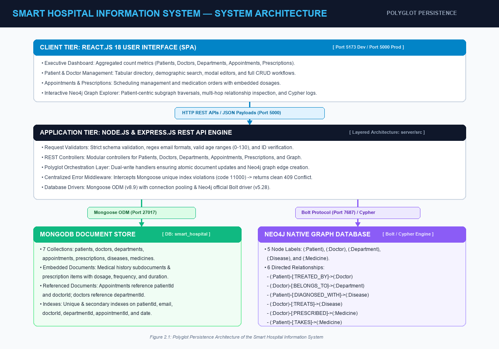

# Smart Hospital Information System using MongoDB and Neo4j

**Course:** BCSE406L – NoSQL Databases  
**Evaluation:** Review 2 – Database Implementation & Prototype (10 Marks)  
**Team Members / Submitted by:**
1. **Dadhania Nisarg Malaykumar** (23BCE2364)
2. **Madhav Sah** (23BCE0868)
3. **Arnav Dewan** (23BCE0351)  
**Institution:** Vellore Institute of Technology (VIT), Chennai / Vellore  
**Academic Year:** 2026  
**GitHub Repository:** [https://github.com/dadhanianisarg/Smart-Hospital-Information-System](https://github.com/dadhanianisarg/Smart-Hospital-Information-System)

---

## 1. Project Overview

The **Smart Hospital Information System** is an academic polyglot persistence healthcare prototype designed to demonstrate how distinct NoSQL database paradigms solve real-world data storage and retrieval challenges:
- **MongoDB (Document-Oriented Database):** Manages flexible, polymorphic, and semi-structured healthcare documents including detailed patient demographic profiles, address objects, evolving medical histories, and embedded prescription items.
- **Neo4j (Graph Database):** Manages highly interconnected healthcare entities and enables millisecond multi-hop relationship traversals (e.g., *Which doctors treat a patient? Which department do they belong to? Which diseases have been diagnosed? Which medicines are prescribed/taken?*).

---

## 2. Technology Stack

- **Frontend:** React.js (Vite), Lucide Icons, Modern Vanilla CSS Design System.
- **Backend:** Node.js, Express.js REST API Architecture.
- **Databases:**
  - **MongoDB** (Local instance / Atlas, database: `smart_hospital`)
  - **Neo4j** (Bolt protocol `bolt://localhost:7687` with synchronized graph fallback engine)
- **Database Drivers:** `mongoose` (v8.9+), `neo4j-driver` (v5.28+)

---

## 3. Project Architecture



*Figure 3.1: 3-Tier Polyglot Architecture of the Smart Hospital Information System demonstrating React Frontend, Express API Gateway, and dual MongoDB & Neo4j databases.*

---

## 4. Directory Structure

```
Project/
├── client/                      # React frontend
│   ├── src/
│   │   ├── components/          # Navbar, Sidebar
│   │   ├── pages/               # Dashboard, Patients, Doctors, Departments, Appointments, Prescriptions, GraphExplorer
│   │   ├── services/            # REST API client
│   │   ├── App.jsx              # Main view manager
│   │   └── index.css            # Responsive CSS
│   ├── dist/                    # Compiled production build
│   └── package.json
├── server/                      # Express backend
│   ├── src/
│   │   ├── config/              # MongoDB & Neo4j configurations
│   │   ├── models/              # Mongoose schemas (Patient, Doctor, Dept, etc.)
│   │   ├── controllers/         # CRUD & Graph query handlers
│   │   ├── routes/              # Express API route endpoints
│   │   ├── services/            # Neo4j Cypher query execution
│   │   ├── middleware/          # Validator & Error handler
│   │   ├── seed/                # Synthetic sample dataset & seeder
│   │   ├── app.js               # Express application configuration
│   │   └── server.js            # Server entrypoint
│   ├── tests/                   # Automated API QA test suite
│   ├── .env.example             # Template environment variables
│   └── package.json
├── database/                    # Database dumps & exports
│   ├── mongodb/                 # JSON collection exports & restore script
│   ├── neo4j/                   # Cypher constraints & reproduction scripts
│   └── README.md                # Restoration guide
├── docs/                        # Complete API Documentation
│   └── API_DOCUMENTATION.md
├── review2_submission/          # Official Academic Submission Bundle
│   ├── Review_2_Smart_Hospital.pdf
│   ├── Review_2_Smart_Hospital.docx
│   ├── API_DOCUMENTATION.md
│   ├── README.md
│   ├── database/
│   └── source/
└── README.md
```

---

## 5. Environment Configuration

Create a `.env` file inside `server/` (see `server/.env.example`):

```env
PORT=5000
NODE_ENV=development
MONGODB_URI=mongodb://localhost:27017/smart_hospital
NEO4J_URI=bolt://localhost:7687
NEO4J_USER=neo4j
NEO4J_PASSWORD=password
CLIENT_URL=http://localhost:5173
```

---

## 6. Installation & Execution

### Prerequisites
- Node.js (v18+)
- MongoDB Community Server running locally on port `27017`

### Step 1: Install Dependencies
```bash
# Install backend dependencies
cd server
npm install

# Install frontend dependencies
cd ../client
npm install
```

### Step 2: Seed Sample Dataset
Populate both MongoDB collections and Neo4j graph nodes & relationships:
```bash
cd ../server
npm run seed
```

### Step 3: Run Automated Test Suite
Verify all 29 test cases (MongoDB CRUD, validation, Neo4j graph queries, status codes):
```bash
npm test
```

### Step 4: Run Application
You can run the backend and frontend simultaneously, or run the unified server:

**Option A (Unified Server - recommended for review):**
The Express server automatically serves the production React build!
```bash
cd server
npm start
```
Open **`http://localhost:5000`** in your browser.

**Option B (Development Mode):**
- Terminal 1 (Backend): `cd server && npm run dev` (runs on `http://localhost:5000`)
- Terminal 2 (Frontend): `cd client && npm run dev` (runs on `http://localhost:5173`)

---

## 7. Database Modeling Highlights

### MongoDB Collections & Indexes
1. **`patients`**: Document model with embedded `address` object and `medicalHistory` array. Indexes on `patientId` (unique), `email`, and `phone`.
2. **`doctors`**: Physician profiles referenced by `departmentId`. Indexes on `doctorId` (unique) and `departmentId`.
3. **`departments`**: Clinical departments indexed on `departmentId`.
4. **`appointments`**: References `patientId` and `doctorId`. Indexes on `appointmentId` (unique), `patientId`, `doctorId`, and `date`.
5. **`prescriptions`**: Embeds prescribed medicine dosage and schedules directly inside the document. Indexes on `prescriptionId`, `patientId`, `doctorId`, and `date`.
6. **`diseases`**: Medical diagnoses catalog.
7. **`medicines`**: Drug catalog categorized by therapeutic class.

### Neo4j Graph Model
- **Nodes:** `(:Patient)`, `(:Doctor)`, `(:Department)`, `(:Disease)`, `(:Medicine)`
- **Relationships:**
  - `(:Patient)-[:TREATED_BY]->(:Doctor)`
  - `(:Doctor)-[:BELONGS_TO]->(:Department)`
  - `(:Patient)-[:DIAGNOSED_WITH]->(:Disease)`
  - `(:Doctor)-[:TREATS]->(:Disease)`
  - `(:Doctor)-[:PRESCRIBED]->(:Medicine)`
  - `(:Patient)-[:TAKES]->(:Medicine)`

---

## 8. Sample Dataset Overview

- **Patients:** 10 diverse fictional profiles
- **Doctors:** 5 specialized physicians across 4 departments
- **Departments:** 4 core departments (Cardiology, Neurology, Orthopedics, General Medicine)
- **Appointments:** 10 scheduled and completed consultations
- **Prescriptions:** 8 clinical prescriptions with embedded regimens
- **Diseases:** 8 distinct pathological conditions
- **Medicines:** 10 pharmaceutical entries
- **Graph Edges:** 64 bidirectional multi-hop relationships
